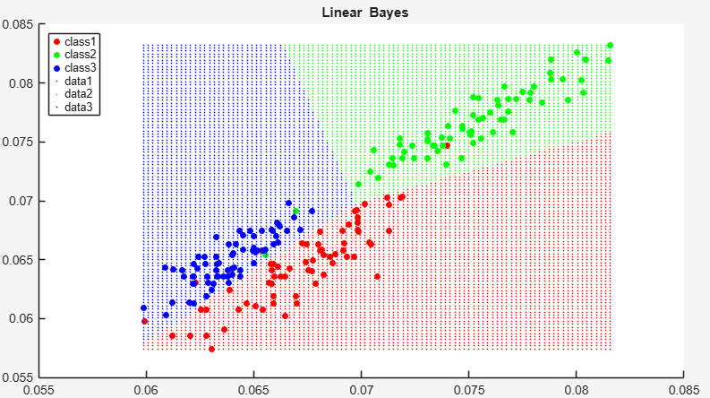
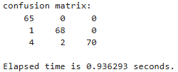
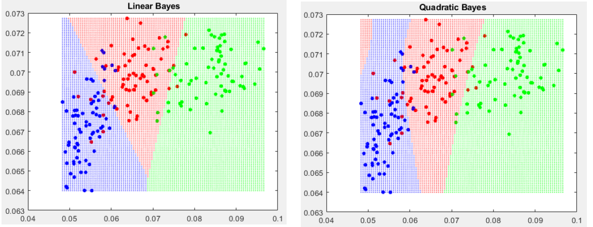
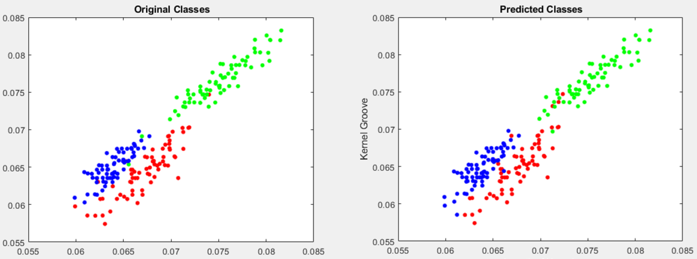

This was a university project for an exam; it contains MATLAB scripts comparing different Bayesian classifiers.
the models take as input a "DataSet.txt", containing different features.
the models were tested using the dataset:    
Charytanowicz, M., Niewczas, J., Kulczycki, P., Kowalski, P., & Lukasik, S. (2010). Seeds [Dataset]. UCI Machine Learning Repository. https://doi.org/10.24432/C5H30K.  
Data for testing were pre-processed and normalized. The input .txt file should have the structure as:   
`%label1 %label2 %label3  ... %class`  
`x_11 x_12 x_13 ...           1`   
`x_21 x_22 ...                2`  
`.`  
`.`  
`.`   

The outputs are displayed in MATLAB's terminal, except figures.   
The feature selection in involved to choose up to 2 features plus the label/class (described by a number).
In the project the files:  
-MyBayesLin: contains a linear classifier. output: confusion matrix, classification image and elapsed time
-MyBayesQ:   contains a quadratic classifier. output: confusion matrix, classification image and elapsed time  
-MyMultipleBayes: different classifiers are considered with different features each. classification involves the mode of results. output: confusion matrix, classification image and elapsed time  
-LOOCV_MyBayes: estimate classification error via LOOCV for Linear and Quadratic models  
-LOOCV_MultipleBayes: estimate classification error via LOOCV for ensemble of models (with different features each)  
(Leave-one-out cross-validation see:https://en.wikipedia.org/wiki/Cross-validation_(statistics)#Leave-one-out_cross-validation)    

## Testing Examples

### Linear classifier example
  
_Figure 1: Linear Model classification._    
In the image above, the dots are colored according to the ground truth. The colored areas represent the regions where the model has divided the space.   
  
_Figure 2: Linear Model confusion matrix results._    

### Linear vs Quadratic example
  
_Figure 3: Linear Model vs Quadratic Model classification._    
In the image above, the dots are colored according to the ground truth. The colored areas represent the regions where the model has divided the space.  

### five classifiers (2 linear + 3 quadratic)  
  
In the image above, confrontation between ground true and models' result.  

