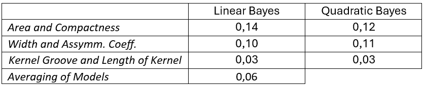

This was a university project for an exam. The objective is to select the most suitable  
Bayesian classifier among the linear and quadratic types, in order to proper classify a dataset.   

the models take in input a "DataSet.txt", containing different features.  
The models were tested using a dataset derived from:    
Charytanowicz, M., Niewczas, J., Kulczycki, P., Kowalski, P., & Lukasik, S. (2010). Seeds [Dataset]. UCI Machine Learning Repository. https://doi.org/10.24432/C5H30K.    

Data for testing were pre-processed and normalized. The input .txt file should have the structure as:   
`%label1 %label2 %label3  ... %class`  
`x_11 x_12 x_13 ...           1`   
`x_21 x_22 ...                2`  
`.`  
`.`  
`.`   

The outputs are displayed in MATLAB's terminal, except figures.   
The feature selection allows to choose up to 2 features plus the label/class (described by a number).
In the project the files:  
* MyBayesLin: contains a linear classifier, printing confusion matrix, classification image and elapsed time
* MyBayesQ:   contains a quadratic classifier, printing confusion matrix, classification image and elapsed time  
* MyMultipleBayes: different classifiers are considered with different features each. classification involves majority vote. 
* LOOCV_MyBayes: estimate classification error via LOOCV for Linear and Quadratic models  
* LOOCV_MultipleBayes: estimate classification error via LOOCV for ensemble of models (with different features each)  
(Leave-one-out cross-validation see:https://en.wikipedia.org/wiki/Cross-validation_(statistics)#Leave-one-out_cross-validation)    

## Testing Examples - Workflow

The implementation considered the dataset mentioned above. The dataset contains three different types of wheat seeds,  
described by seven features. The goal is thus to  train a model for classification. The dataset is not 'big', it contains   
70 samples for each category. It should be suitable for Bayesian classifier, while a complex model such ANN network would   
require more training data.   

After normalization of data, it was necessary to carry out a feature extraction process. This is required in order to select the   
most suitable features for the model. Indeed, as you can see below, some feature cannot be separated with linear relations. 

  
_Figure 1: Examples of features space._      
 
In the figures above it is possible to visually see that in these cases two features are not sufficient to classify correctly. The three   
classes are not all simultaneously distinguishable from each other. This is reflected in a very high classification error, which exceeds   
15% with the linear Bayes model. Below are the graph and results using three features Compactness, Asymmetry Coeff. and Length of Kernel   
Groove, which improves the classification of previous cases although still with a margin of error of more than 10%.

  
_Figure 2: Results of Linear classification using 3 features._      

### Linear and Quadratic classifiers

  
_Figure 3: Linear Model classification._      
In the image above, the dots are colored according to the ground truth. The colored areas represent the regions where the model has divided the space.     

   
_Figure 3: Quadratic Model classification._      
In the image above, the dots are colored according to the ground truth. The colored areas represent the regions where the model has divided the space.     

Both linear and quadratic models performed similarly, leading to the same classification.
The confusion matrix for both cases is shown below. The case classification correctly predicts nearly 97% of the samples. As can be seen from the graphs, the residual error is caused by some outliers that do not allow perfect classification. The linear classifier requires less training time, and in this case would be more convenient to use due to its simplicity. A possible test set with new data could establish which of the two models is better in an absolute sense, since they define different decision regions.

### five classifiers (2 linear + 3 quadratic) 

In this case, training was done on five models, linear and quadratic, using different features. The classification  
was done using the majority voting.   
Below, a resume of the model used:  

   

  
_Figure 4: Ground truth vs Model ensemble prediction._     
In the image above is reported the confrontation between the ground true and the classification. Results  
are showed below as confusion matrix:

  

### Result comparison, Leave-One-Out Cross-Validation and results
Philosophically we could mention Occam's razor, and therefore indicate as the best solution the simpler one   
and with fewer parameters.  In this case the best classifier among those seen is the Bayesian linear classifier,  
which uses the two features Kernel Groove and Length of Kernel. It is in fact the simplest one and which provides   
a very valid solution. All other models have no obvious advantages.   

To conclude correctly, however, one should have a test-set, and see which of the models can best generalize to new cases.  
In this case, the dataset is small, and a general sub-division of the dataset in training set and test set can have lot of   
variability. Numbers of two set would be too small. A proper way to address this issue can be the use of cross-validation,   
in particular Leave-One-Out Cross-Validation can be used, that can be used when dataset is small. This consists in dividing   
the dataset in two part: a test set composed by one sample, and a training set composed by the other samples. The training   
step is done many times, changing each time the test set (sample) and evaluating the error. At the end, each sample in the   
dataset has been one time in the test set; then the error is averaged.
LOOCV have been used on previous cases, the error results (averaged) for the different models are shown below:

  

Models performed slightly worse than before (the error has increased), this because models have been tested on “new” samples.  
However at last, models using Kernel Groove and Length of Kernel are still the better, and the error is the same for both.    
Hence, Linear Bayes should be preferred for its simplicity.

